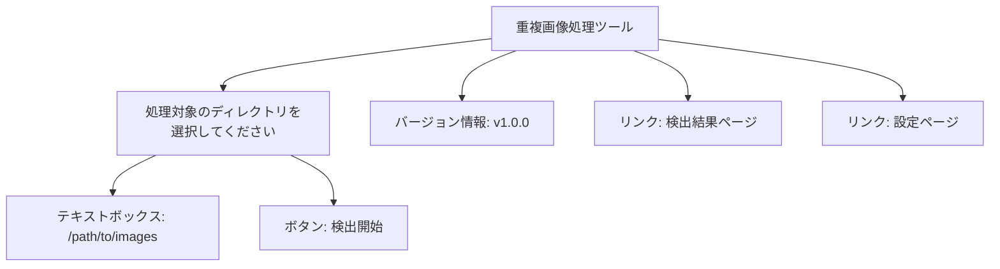
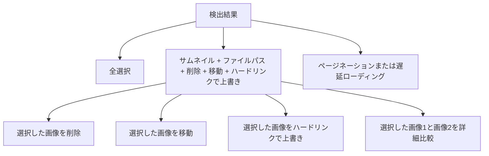
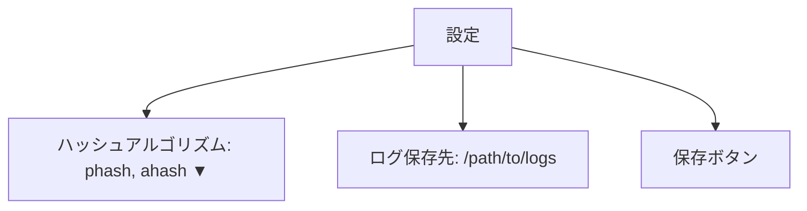

# UI 設計

このドキュメントでは、重複画像処理ツールの Web UI の設計について説明します。

## ページ構成

### 1. ホームページ

- **URL**: `/`
- **目的**: ユーザーが処理対象のディレクトリを選択し、重複画像の検出を開始する。
- **要素**:
  - ヘッダー: プロジェクト名と簡単な説明。
  - ディレクトリ選択フォーム:
    - テキストボックス: 処理対象のディレクトリパスを入力。
    - ボタン: 「検出開始」ボタン。
  - フッター: バージョン情報とリンク。
  - ページリンク: 検出結果ページや設定ページへのリンク。

### 2. 検出結果ページ

- **URL**: `/results`
- **目的**: 検出された重複画像を表示し、ユーザーが操作を選択できる。
- **要素**:
  - **画像ごとの操作**:
    - サムネイル画像: 重複画像のプレビュー。
    - ファイルパス: 各画像のパスを表示。
    - ボタン:
      - フルサイズ表示（詳細比較）
      - 削除
      - 移動
      - ハードリンクで上書き
  - **全体操作**:
    - 「全選択」チェックボックス。
    - 「選択した画像を削除」ボタン。
    - 「選択した画像を移動」ボタン。
    - 「選択した画像1で画像2をハードリンクで上書き」ボタン。
    - 「選択した画像1と画像2を詳細比較」ボタン。
  - ページネーションまたは遅延ローディング:
    - 検出結果を一定数（例: 50 件）ごとに分割して表示。
    - 「次へ」「前へ」ボタン、またはスクロール時に追加データを読み込む遅延ローディングを実装。

### 3. 設定ページ

- **URL**: `/settings`
- **目的**: ユーザーがアプリケーションの設定を変更する。
- **要素**:
  - ハッシュアルゴリズム選択:
    - ドロップダウンメニューでアルゴリズムを選択（例: phash, ahash）。
  - ログ保存先の指定:
    - テキストボックスでログファイルの保存先を指定。
  - 保存ボタン: 設定を保存する。

## ワイヤーフレーム

### ホームページ

### 検出結果ページ

### 設定ページ

## 注意事項

- UI はレスポンシブデザインを採用し、PC とモバイルの両方で利用可能にします。
- 必要に応じて、CSS フレームワーク（例: Bootstrap）を使用してデザインを簡略化します。
